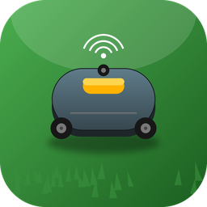

  

<h1 align="center">Sunseeker / Bugull Robotic Mower</h1>

<strong>Integracja Home Assistant dla robotów koszących na platformie Bugull</strong>

  
  
  
  

---

> ⚠️ **Nieoficjalna integracja.** Nie jest tworzona ani wspierana przez producenta.
> Protokół API odtworzono na podstawie analizy własnej aplikacji mobilnej, wyłącznie
> do użytku prywatnego i interoperacyjności z zakupionym sprzętem.

## O co chodzi

Roboty koszące oparte o platformę chmurową **Bugull** (`server.sk-robot.com`) —
używaną m.in. przez aplikację **"Robotic Mower"** — nie mają żadnej oficjalnej
integracji z Home Assistant. Ta integracja loguje się do tego samego API co
aplikacja mobilna i udostępnia dane kosiarki jako standardowe encje HA.

Pasuje m.in. do modeli z rodziny **RMA2002L20V-DLSUHS** (rebrandy AMA/RBA2000
i podobne, sprzedawane pod różnymi markami).

## 📊 Dostępne sensory

| Sensor | Opis | Jednostka |
|---|---|---|
| 🌱 Powierzchnia koszenia | Łączna skoszona powierzchnia od początku eksploatacji | m² |
| ⏱️ Czas pracy | Łączny czas pracy silnika | h |
| 🔋 Bateria | Aktualny poziom naładowania | % |
| ⚡ Średnia wydajność koszenia | Powierzchnia ÷ czas pracy (średnia całkowita) | m²/h |
| 🧭 Status | Bieżący stan pracy (Pracuje / Nieznany + surowy kod w atrybutach) | – |
| ⚠️ Usterka | Status usterki (OK / Nieznany + surowy kod w atrybutach) | – |
| 🗺️ Całkowita powierzchnia ogródka | Powierzchnia wynikająca z geometrii mapy/pętli granicznej | m² |
| 📏 Długość pętli granicznej | Długość przewodu ograniczającego obszar koszenia | m |

Wszystkie teksty dostępne w **języku polskim i angielskim** (zgodnie z ustawieniem
języka Home Assistant), niezależnie od tego, co zwraca serwer producenta.

## 📦 Instalacja

### Przez HACS (custom repository)

1. HACS → ⋮ (trzy kropki) → **Custom repositories**
2. URL: `https://github.com/dobrzynskim/ha-sunseeker-mower`, kategoria: **Integration**
3. Znajdź **"Sunseeker / Bugull Robotic Mower"** na liście → **Download**
4. Zrestartuj Home Assistant

### Ręcznie

1. Skopiuj folder `custom_components/sunseeker_mower/` do `<config>/custom_components/`
2. Zrestartuj Home Assistant

## ⚙️ Konfiguracja

**Ustawienia → Urządzenia i usługi → Dodaj integrację → "Sunseeker / Bugull Robotic Mower"**

Podaj e-mail i hasło używane w oficjalnej aplikacji mobilnej. Dane odświeżane są
cyklicznie co 15 minut.

## 🔧 Jak to działa (technicznie)

Producent nie udostępnia publicznego API. Endpointy i protokół zostały odtworzone
poprzez analizę kodu źródłowego (dekompilacja jadx) własnej kopii aplikacji
mobilnej, w celu zapewnienia interoperacyjności z zakupionym sprzętem. Adres
serwera i struktura zapytań mogą się zmienić bez ostrzeżenia — w takim wypadku
integracja przestanie działać do czasu aktualizacji.

## 🗺️ Plany na przyszłość

- Cykle ładowania / rozładowania baterii (wymaga lokalnego MQTT — dane te nie
  są dostępne przez REST API producenta)
- Dane bieżącej sesji koszenia (powierzchnia/czas aktualnego wyjścia, nie tylko
  suma całkowita)

## 📄 Licencja

MIT — zobacz [LICENSE](LICENSE).
